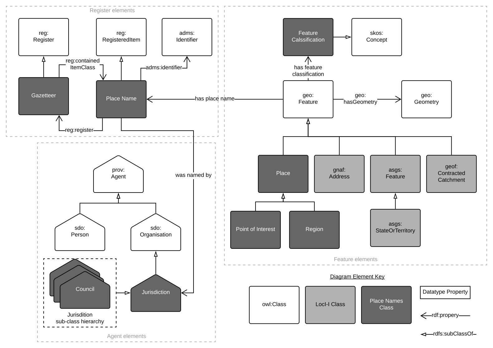

# Place Names Profile
A data model for the Australian Place Names Gazetteer.

This is an ontology that profiles several other ontologies. It describes Place Names that are used in the Place Names Gazetteer of Australia. Place Names are names given to natural and artificial geospatial features, such as administrative areas, political regions, mountain ranges, rivers, bays etc. Place Names are assigned and managed by multiple Jurisdictions around Australia and may have varying status: official, historical etc. This ontology provides a meta model to bring Place Name data together in one Semantic Web data collection.

This profile is online at a persistent URI: <http://linked.data.gov.au/def/placenames>  

## Documentation
See the persistent online location above for documentation.

Additionally, the RDF source for this profile is available above and also here:
* [placenames.ttl](placenames.ttl) - in the Turtle format

The figure below, also at the online location, provides a quick overview of the ontology.
  
**Figure 1**: a diagrammatic overview of this ontology - not all details.

There are other images documenting parts o the ontology too:
* [hierarchy of classes in the profile](hierarchy.png)
* [Properties of the Place Names class](placename-properties.svg)

## Design choices
This ontology makes several design choices to facilitate certain behaviour. Some of those choices are listed below:

1. **Separation of spatiality from `Place Name`**
  * the `Place Name` classes, unlike v1 of this profile/ontology, contains no spatial properties such as geometry.
  * this is to ensure that all `Place Names` are made names of separately identified `Feature` class instances. This ensures that `Place Names` are always bound to other spatial Linked Data Datasets - perhaps specifically [Loc-I Datasets](http://linked.data.gov.au/def/loci#Dataset) which ensures that all `PlaceNames` integrated with other (Australian) spatial Linked Data systems
1. **Jurisdictions are `Agent`s only**
  * i.e. `Jurisdiction` has no spatial component (the area a Jurisdiction has jurisdiction over)
  * this is to again ensure that any notion of spatiality is linked to existing (Loc-I) spatial objects, such as `States or Territories` in the [ASGS 2016](https://asgsld.net/2016/stateorterritory/), rather than re-defining them within this Place Names Profile
    * so, a `Place Name` (well, the `Feature` it is of) is *within* a, `ASGS State or Territory` or perhaps a Geofabric [Catchment](geofabricld.net/catchment/) rather than *within* a `Jurisdiction`
  * the role of a `Jurisdiction` within this profile is exactly that of a [PROV](https://www.w3.org/TR/prov-o/) `Agent`, that is to have things attributed to it. This profile is about `Place Names` and it's the creation of them that are attributed to `Jurisdictions` here
1. **Property chaining of `hasPlaceName`**
  * ...
1. **Implementing a vocabulary for Place Name Formality**
  * ...
1. **Declaring `Gazetteer` to be a `Register`**
  * ...

## License
The content of this API is licensed for use under the [Creative Commons 4.0 License](https://creativecommons.org/licenses/by/4.0/). See the [license deed](LICENSE) all details.

## Contacts
*author*:  
**Nicholas Car**  
CSIRO Land & Water, Environmental Informatics Group  
<nicholas.car@csiro.au>  

*product owner*:  
**Irina Bastrakova**  
Geoscience Australia, National Land Information  
<irina.bastrakova@ga.gov.au>
